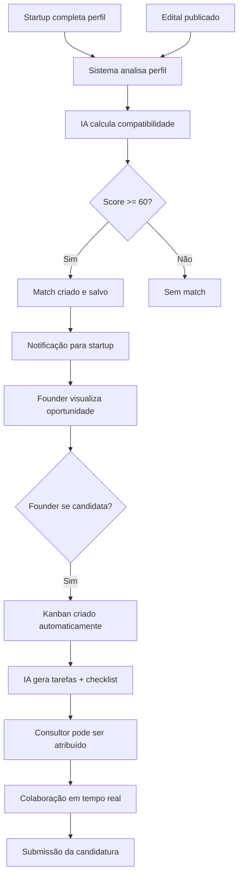

# Plataforma Conex

## 📋 O que é

A **Plataforma Conex** é um ecossistema digital que conecta startups, consultores especializados e órgãos de fomento através de inteligência artificial, facilitando o acesso a editais públicos e privados de incentivo à inovação.

---

## 🎯 Para quem é

### **Startups e Empreendedores** (Founders)
- Startups em qualquer estágio (early-stage a growth)
- Empresas de base tecnológica
- Negócios inovadores buscando captação de recursos
- Empreendedores que querem profissionalizar suas candidaturas

### **Consultores Especializados**
- Profissionais com experiência em editais de fomento
- Especialistas em inovação e captação de recursos
- Consultores que desejam expandir sua carteira de clientes
- Profissionais que buscam otimizar seu tempo com ferramentas inteligentes

### **Órgãos de Fomento e Instituições** (Representantes)
- FAPs (Fundações de Amparo à Pesquisa)
- Agências de fomento estaduais e federais
- Incubadoras e aceleradoras
- Instituições que desejam maior visibilidade para seus editais

---

## 💎 O que oferece

### **Para Startups**
- **Matching Inteligente**: IA identifica os editais mais compatíveis com seu perfil
- **Análise de Oportunidades**: Relatórios detalhados de compatibilidade (score de 0-100)
- **Gestão de Candidaturas**: Sistema Kanban para organizar todo o processo
- **Calendário de Deadlines**: Nunca perca um prazo importante
- **Suporte Especializado**: Acesso a consultores qualificados
- **Documentação Inteligente**: Checklists automáticas baseadas nos requisitos do edital

### **Para Consultores**
- **Dashboard Completo**: Visão 360° de todas as startups e editais
- **Gestão Multi-Startups**: Gerencie candidaturas de várias startups simultaneamente
- **Sistema de Recomendação**: IA sugere consultores para cada demanda
- **Chat Integrado**: Comunicação direta com founders
- **Templates de Documentos**: Acelere a criação de propostas
- **Histórico e Avaliações**: Construa sua reputação na plataforma

### **Para Instituições**
- **Divulgação Ampliada**: Alcance milhares de startups qualificadas
- **Cadastro Simplificado**: Sistema de registro de editais otimizado
- **Extração Automática de PDFs**: IA extrai informações de editais em PDF
- **Analytics**: Acompanhe métricas de interesse e candidaturas
- **Perfil Institucional**: Apresente sua instituição de forma profissional

---

## 🚀 Diferenciais

### **1. Inteligência Artificial Proprietária**
- **Matching Algorithm**: Calcula compatibilidade entre startups e editais considerando múltiplos critérios (área de atuação, TRL, localização, funding, etc.)
- **Análise Contextual**: Google Gemini e GPT-5 analisam documentos e geram insights personalizados
- **Recomendações Personalizadas**: Sistema de aprendizado contínuo baseado em feedback

### **2. Colaboração Real em Tempo Real**
- Sistema Kanban sincronizado entre consultor e founder
- Chat integrado com notificações
- Atualizações instantâneas de progresso

### **3. Automação Inteligente**
- Extração automática de dados de PDFs de editais
- Geração automática de checklists de documentação
- Templates de tarefas baseados em tipo de edital
- Busca automatizada de novos editais (Comet AI/Perplexity)

### **4. Conformidade Legal (LGPD)**
- Sistema completo de gestão de consentimento
- Transparência no uso de IA
- Direitos de acesso, correção e exclusão de dados
- DPO dedicado

### **5. Gestão Visual e Intuitiva**
- Dashboard personalizado por perfil
- Calendário integrado de deadlines
- Métricas e KPIs em tempo real
- Design responsivo e moderno

### **6. Ecossistema Completo**
- Marketplace de consultores
- Sistema de avaliações e feedback
- Histórico de projetos
- Rede de networking entre founders e consultores

---

## 🔄 Como funciona

### **Para Startups (Founders)**

#### **1. Cadastro e Perfil**
```
Cadastro → Onboarding → Completar perfil da startup
         (pronome,     (nome, área, TRL, equipe,
          biografia)    documentos, redes sociais)
```

#### **2. Descoberta de Oportunidades**
```
IA analisa perfil → Busca editais compatíveis → Calcula score de match
                                                  (0-100 pontos)
```

#### **3. Análise Detalhada**
```
Relatório IA → Pontos fortes/fracos → Recomendações → Documentação necessária
              (compatibilidade)       (ações)          (checklist)
```

#### **4. Candidatura**
```
Clica "Me Candidatar" → Kanban criado automaticamente → Tarefas geradas pela IA
                         (específico para o edital)       (checklist de docs)
```

#### **5. Gestão**
```
Acompanha progresso → Move cards no Kanban → Interage com consultor → Submete candidatura
(% de conclusão)      (To Do → Doing →       (chat + comentários)    (quando 100%)
                       Review → Done)
```

---

### **Para Consultores**

#### **1. Cadastro e Perfil Profissional**
```
Cadastro → Aprovação admin → Completar perfil → Definir especialidades
                              (experiência,      (áreas, TRL, regiões)
                               bio, redes)
```

#### **2. Recebimento de Demandas**
```
Sistema recomenda para chamados → Consultor aceita → Startup notificada
(baseado em especialidades)        demanda          (match confirmado)
```

#### **3. Gestão de Startups**
```
Dashboard multi-startups → Visualiza todos os Kanbans → Prioriza tarefas
                           (um board por candidatura)
```

#### **4. Trabalho Colaborativo**
```
Atualiza cards → Adiciona comentários → Chat com founder → Revisa documentos
                 (feedback IA)          (tempo real)       (checklist)
```

#### **5. Construção de Reputação**
```
Completa projetos → Recebe avaliações → Score aumenta → Mais recomendações
                    (1-5 estrelas)      (ranking)       (algoritmo IA)
```

---

### **Para Instituições (Representantes)**

#### **1. Registro**
```
Solicita acesso → Aprovação admin → Perfil institucional → Primeiro edital
(/divulgar-edital) (verificação)    (CNPJ, logo, site)
```

#### **2. Cadastro de Editais**

**Opção A - Manual**:
```
Preenche formulário → Revisa dados → Publica edital
(todos os campos)
```

**Opção B - IA (PDF)**:
```
Upload PDF → IA extrai dados → Admin revisa → Aprova → Edital publicado
             (Gemini/GPT-5)    (draft_calls)   (calls table)
```

**Opção C - Busca Automática**:
```
Sistema Comet AI → Busca editais abertos → Extrai dados → Admin aprova
(Perplexity)       (FAPs, Lei do Bem, etc)  (draft)       (publica)
```

#### **3. Gestão**
```
Dashboard institucional → Acompanha métricas → Visualiza candidaturas → Exporta relatórios
                          (visualizações,      (startups interessadas)
                           matches gerados)
```

---

## 🎯 Fluxo Completo de Matching



---

## 📊 Algoritmo de Matching

### **Critérios de Compatibilidade** (Score 0-100)

| Critério | Peso | Descrição |
|----------|------|-----------|
| **Área de Atuação** | 30% | Match entre área da startup e beneficiários do edital |
| **TRL (Technology Readiness Level)** | 20% | Estágio de maturidade tecnológica compatível |
| **Localização Geográfica** | 15% | Abrangência do edital vs localização da startup |
| **Funding (Valor de Fomento)** | 15% | Capacidade de captação vs necessidade da startup |
| **Documentação** | 10% | Startup possui docs necessários para candidatura |
| **Keywords** | 10% | Match entre palavras-chave do edital e da startup |

### **Fórmula de Cálculo**
```
Score = (área × 0.30) + (TRL × 0.20) + (geo × 0.15) + 
        (funding × 0.15) + (docs × 0.10) + (keywords × 0.10)
```

**Classificação de Matches**:
- 🟢 **90-100**: Altamente compatível (Perfect match)
- 🟡 **70-89**: Muito compatível (Recomendado)
- 🟠 **60-69**: Compatível (Avaliar)
- 🔴 **< 60**: Pouco compatível (Não exibido)

---

## 🛠️ Tecnologias e Arquitetura

### **Frontend**
- React 18.3.1 + TypeScript
- Vite (build tool)
- Tailwind CSS (design system)
- shadcn/ui (componentes)
- React Query (cache e state management)
- React Router (navegação)

### **Backend (Lovable Cloud)**
- Supabase (PostgreSQL 15)
- Row Level Security (RLS) para segurança
- Edge Functions (Deno) para lógica de negócios
- Realtime (WebSockets) para atualizações ao vivo
- Storage (S3-compatible) para arquivos

### **Inteligência Artificial**
- **Lovable AI Gateway**: google/gemini-2.5-flash (padrão)
- **Google Gemini**: gemini-2.5-pro (análises complexas)
- **OpenAI GPT-5**: Fallback e casos específicos
- **Comet AI** (Perplexity): Busca automática de editais

### **Infraestrutura**
- Deploy automático via Lovable
- CDN global
- SSL/HTTPS nativo
- Backup automático de banco de dados

---

## 📈 Métricas e KPIs

### **Métricas para Startups**
- Total de matches gerados
- Score médio de compatibilidade
- Candidaturas em andamento
- Taxa de conclusão de candidaturas
- Potencial de fomento (R$ total de editais compatíveis)

### **Métricas para Consultores**
- Startups gerenciadas
- Candidaturas em progresso
- Taxa de aprovação (histórico)
- Avaliação média (1-5 estrelas)
- Ranking no sistema

### **Métricas para Instituições**
- Visualizações do edital
- Matches gerados
- Candidaturas recebidas
- Taxa de conversão (matches → candidaturas)
- Alcance geográfico

---

## 🔒 Segurança e Privacidade

### **Conformidade LGPD**
- ✅ Consentimento explícito para uso de IA
- ✅ Cookie banner e política de privacidade
- ✅ Direitos de acesso, correção, exclusão
- ✅ DPO dedicado (dpo@digitalconex.com.br)
- ✅ Transparência em processamento de dados
- ✅ Direito à revisão humana (Art. 20 LGPD)

### **Segurança Técnica**
- Row Level Security (RLS) em todas as tabelas
- Autenticação via Supabase Auth
- Secrets management para API keys
- Audit logs para todas as ações críticas
- HTTPS obrigatório
- Backups automáticos diários

---

## 🎓 Casos de Uso

### **Caso 1: Startup Early-Stage**
**Perfil**: Startup de HealthTech, TRL 3-4, SP capital, buscando até R$ 500k

**Jornada**:
1. Cadastro e perfil completo (15min)
2. Sistema encontra 8 editais compatíveis
3. Match de 92% com edital FAPESP PIPE
4. Analisa relatório IA: "Forte alinhamento em inovação em saúde digital"
5. Clica "Me Candidatar" → Kanban com 23 tarefas criado
6. Contrata consultor recomendado (especialista em FAPESP)
7. Completa candidatura em 3 semanas
8. Submete proposta com 100% dos requisitos atendidos

### **Caso 2: Consultor Experiente**
**Perfil**: 10 anos de experiência, especialista em editais FINEP e CNPq

**Jornada**:
1. Cadastro aprovado com perfil completo
2. Sistema recomenda para 5 chamados ativos
3. Aceita 3 startups (capacidade: até 5 simultâneas)
4. Dashboard mostra 3 Kanbans (um por candidatura)
5. Usa templates de documentos para acelerar
6. Chat em tempo real com founders para tirar dúvidas
7. Completa 3 candidaturas em 1 mês
8. Recebe avaliação 5⭐ das 3 startups
9. Ranking aumenta → Recebe mais recomendações

### **Caso 3: FAP Estadual**
**Perfil**: Fundação de amparo à pesquisa buscando divulgar novo edital

**Jornada**:
1. Solicita acesso via `/divulgar-edital`
2. Admin aprova em 24h
3. Faz upload do PDF do edital (47 páginas)
4. IA extrai dados automaticamente
5. Admin revisa e publica
6. Edital aparece para 234 startups compatíveis
7. 47 matches gerados automaticamente
8. 12 startups iniciam candidatura
9. Dashboard mostra métricas de engajamento
10. Exporta relatório de candidaturas

---

## 🌟 Benefícios por Perfil

### **Startups**
- ⏱️ **Economia de tempo**: IA encontra editais relevantes (80% mais rápido)
- 💰 **Mais captação**: Match inteligente aumenta taxa de aprovação
- 📊 **Organização**: Kanban mantém tudo sob controle
- 🎓 **Aprendizado**: Relatórios IA ensinam o que melhorar
- 🤝 **Networking**: Acesso a consultores qualificados

### **Consultores**
- 📈 **Mais clientes**: Sistema recomenda para startups certas
- ⚡ **Produtividade**: Templates e automações economizam 60% do tempo
- 💼 **Profissionalização**: Ferramentas enterprise-grade
- ⭐ **Reputação**: Sistema de avaliações constrói credibilidade
- 🔄 **Recorrência**: Startups voltam para novas candidaturas

### **Instituições**
- 📢 **Visibilidade**: Alcance muito maior que divulgação tradicional
- 🎯 **Público qualificado**: Apenas startups compatíveis veem o edital
- 📊 **Analytics**: Dados em tempo real sobre interesse
- ⚡ **Agilidade**: Cadastro em minutos vs dias
- 🤖 **Automação**: IA faz trabalho pesado de triagem

---

## 📞 Contato e Suporte

**Digital Conex - Plataforma Conex**  
📧 E-mail: contato@digitalconex.com.br  
📱 WhatsApp: +55 (98) 98109-7026  
🌐 Site: https://plataforma.digitalconex.com.br

**Suporte Técnico**: suporte@digitalconex.com.br  
**DPO (Privacidade)**: dpo@digitalconex.com.br  
**Comercial**: comercial@digitalconex.com.br

---

## 📄 Licença e Termos

- **Versão**: v0.4.0 (Beta Fechado)
- **CNPJ**: 38.259.497/0001-30 (SEU MPV)
- **Termos de Uso**: [/termos-uso](https://plataforma.digitalconex.com.br/termos-uso)
- **Política de Privacidade**: [/politica-privacidade](https://plataforma.digitalconex.com.br/politica-privacidade)

---

**Última atualização**: 23 de novembro de 2025  
**Documento criado para**: Apresentação institucional e onboarding de novos usuários
