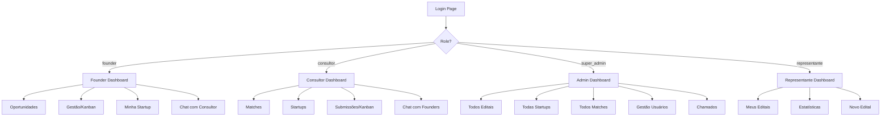
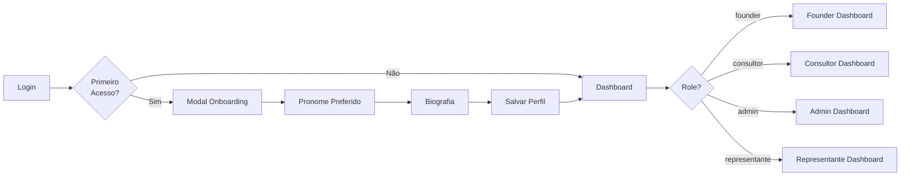
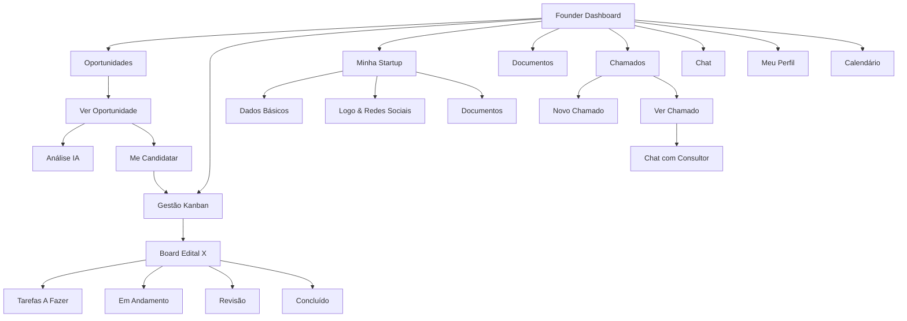
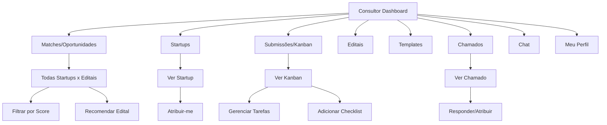
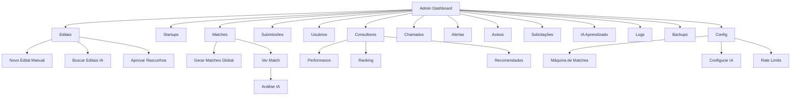
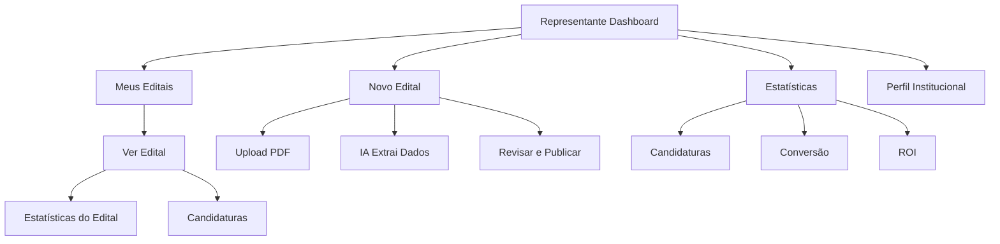

# 🎨 Wireframes e Fluxos - Plataforma Conex v0.5.1

## 📋 Índice
1. [Visão Geral do Sistema](#visão-geral-do-sistema)
2. [Fluxo de Autenticação](#fluxo-de-autenticação)
3. [Fluxo Founder](#fluxo-founder)
4. [Fluxo Consultor](#fluxo-consultor)
5. [Fluxo Admin](#fluxo-admin)
6. [Fluxo Representante](#fluxo-representante)
7. [Wireframes Detalhados](#wireframes-detalhados)

---

## Visão Geral do Sistema



---

## Fluxo de Autenticação

### 1. Tela de Login (Split-Screen Golden Ratio 62/38)

```
┌─────────────────────────────────────────────────────────────────────┐
│                                                                     │
│  ┌──────────────────────────┬───────────────────────────────────┐  │
│  │                          │                                   │  │
│  │     [Illustration]       │   ┌─────────────────────────────┐ │  │
│  │                          │   │   🔐 Bem-vindo              │ │  │
│  │   [Floating geometric    │   │   à Plataforma Conex        │ │  │
│  │    shapes with violet    │   └─────────────────────────────┘ │  │
│  │    and blue gradients]   │                                   │  │
│  │                          │   📧 Email                        │  │
│  │                          │   ┌─────────────────────────────┐ │  │
│  │   [Modern, minimalist]   │   │ seu@email.com               │ │  │
│  │                          │   └─────────────────────────────┘ │  │
│  │   [Innovation vibes]     │                                   │  │
│  │                          │   🔒 Senha                        │  │
│  │                          │   ┌─────────────────────────────┐ │  │
│  │                          │   │ ••••••••                    │ │  │
│  │                          │   └─────────────────────────────┘ │  │
│  │                          │                                   │  │
│  │                          │   [Esqueci minha senha]           │  │
│  │                          │                                   │  │
│  │                          │   ┌─────────────────────────────┐ │  │
│  │                          │   │      [Entrar] 🚀            │ │  │
│  │                          │   └─────────────────────────────┘ │  │
│  │                          │                                   │  │
│  │                          │   Não tem conta?                  │  │
│  │                          │   [Criar conta gratuitamente]     │  │
│  │                          │                                   │  │
│  │                          │   ┌─────────────────────────────┐ │  │
│  │                          │   │ 📢 Quer divulgar seu edital?│ │  │
│  │                          │   │    [Saiba mais →]           │ │  │
│  │                          │   └─────────────────────────────┘ │  │
│  │      62%                 │              38%                  │  │
│  └──────────────────────────┴───────────────────────────────────┘  │
│                                                                     │
└─────────────────────────────────────────────────────────────────────┘
```

### 2. Fluxo de Onboarding (Primeiro Acesso)



---

## Fluxo Founder

### Mapa de Navegação



### Dashboard Founder - Wireframe

```
┌─────────────────────────────────────────────────────────────────────────────┐
│ [☰] Conex                    [🔔] [👤 João Silva - Founder] v0.5.1          │
├─────────────────────────────────────────────────────────────────────────────┤
│ [Home] > Painel                                                             │
├─────────────────────────────────────────────────────────────────────────────┤
│                                                                             │
│  Olá, João! 👋                                                              │
│                                                                             │
│  ┌──────────────────────────┐  ┌──────────────────────────┐               │
│  │ 📊 Estatísticas Rápidas  │  │ 🎯 Complete seu Perfil   │               │
│  │                          │  │                          │               │
│  │ 🎯 8 Oportunidades       │  │ ████████░░ 80%          │               │
│  │ 📋 3 Candidaturas Ativas │  │                          │               │
│  │ 💰 R$ 2,5M em Potencial  │  │ Faltam:                  │               │
│  │ ⭐ Score Médio: 87/100   │  │ ✓ Logo da startup        │               │
│  │                          │  │ ✓ Redes sociais          │               │
│  └──────────────────────────┘  └──────────────────────────┘               │
│                                                                             │
│  ┌───────────────────────────────────────────────────────────────────────┐ │
│  │ 🏆 Principais Oportunidades                       [Ver todas →]       │ │
│  ├───────────────────────────────────────────────────────────────────────┤ │
│  │                                                                       │ │
│  │  [FAPEMA] Inovação Tecnológica 2025             Score: 92/100 🟢    │ │
│  │  💰 R$ 500.000 | 📅 Deadline: 15/02/2025                            │ │
│  │  ───────────────────────────────────────────────────────────────     │ │
│  │                                                                       │ │
│  │  [FINEP] Startup de Base Tecnológica             Score: 88/100 🟢   │ │
│  │  💰 R$ 1.000.000 | 📅 Deadline: 28/02/2025                          │ │
│  │  ───────────────────────────────────────────────────────────────     │ │
│  │                                                                       │ │
│  │  [FAPESP] Pesquisa Inovadora - PIPE             Score: 85/100 🟡    │ │
│  │  💰 R$ 800.000 | 📅 Deadline: 10/03/2025                            │ │
│  │                                                                       │ │
│  └───────────────────────────────────────────────────────────────────────┘ │
│                                                                             │
│  ┌──────────────────────────┐  ┌──────────────────────────┐               │
│  │ 📅 Próximos Deadlines    │  │ 🚀 Ações Recomendadas    │               │
│  │                          │  │                          │               │
│  │ 🔴 15/02 - FAPEMA        │  │ • Revisar documentação   │               │
│  │ 🟡 28/02 - FINEP         │  │   do edital FAPEMA       │               │
│  │ 🟢 10/03 - FAPESP        │  │ • Completar perfil       │               │
│  │                          │  │ • Upload de pitch deck   │               │
│  │ [Ver calendário →]       │  │                          │               │
│  └──────────────────────────┘  └──────────────────────────┘               │
│                                                                             │
└─────────────────────────────────────────────────────────────────────────────┘
```

### Página de Oportunidade (Detalhada)

```
┌─────────────────────────────────────────────────────────────────────────────┐
│ [☰] Conex                    [🔔] [👤 João Silva - Founder] v0.5.1          │
├─────────────────────────────────────────────────────────────────────────────┤
│ [Home] > [Oportunidades] > FAPEMA - Inovação Tecnológica 2025              │
├─────────────────────────────────────────────────────────────────────────────┤
│                                                                             │
│  ┌───────────────────────────────────────────────────────────────────────┐ │
│  │                     Score de Compatibilidade                          │ │
│  │                                                                       │ │
│  │                        ╔═══════════╗                                  │ │
│  │                        ║    92     ║                                  │ │
│  │                        ║   /100    ║                                  │ │
│  │                        ╚═══════════╝                                  │ │
│  │                          🟢 ALTA                                       │ │
│  └───────────────────────────────────────────────────────────────────────┘ │
│                                                                             │
│  ┌─────────────────────────────────┬─────────────────────────────────────┐ │
│  │ 🏢 Sua Startup                  │ 📋 Edital                           │ │
│  │                                 │                                     │ │
│  │ [Logo] TechStartup              │ FAPEMA                              │ │
│  │ Inteligência Artificial         │ Inovação Tecnológica 2025           │ │
│  │ TRL: 6 | 15 funcionários        │                                     │ │
│  │                                 │ 💰 Até R$ 500.000                   │ │
│  │ Keywords:                       │ 📅 Aberto: 01/01/2025               │ │
│  │ [IA] [Machine Learning] [SaaS]  │ 🔴 Deadline: 15/02/2025             │ │
│  │                                 │                                     │ │
│  │                                 │ Keywords:                           │ │
│  │                                 │ [IA] [Inovação] [Tecnologia]        │ │
│  └─────────────────────────────────┴─────────────────────────────────────┘ │
│                                                                             │
│  ┌───────────────────────────────────────────────────────────────────────┐ │
│  │ 🤖 Análise Detalhada por IA                [Cache: atualizado há 2h]  │ │
│  ├───────────────────────────────────────────────────────────────────────┤ │
│  │                                                                       │ │
│  │ ✅ Pontos Fortes:                                                     │ │
│  │ • Alinhamento perfeito com foco em IA e Machine Learning             │ │
│  │ • TRL compatível (mínimo 5, sua startup tem 6)                       │ │
│  │ • Localização elegível (Maranhão)                                    │ │
│  │                                                                       │ │
│  │ ⚠️ Pontos de Atenção:                                                 │ │
│  │ • Prazo curto - apenas 30 dias para submissão                        │ │
│  │ • Requer contrapartida de 20%                                        │ │
│  │                                                                       │ │
│  │ 💡 Recomendações:                                                     │ │
│  │ • Priorize a preparação da documentação técnica                      │ │
│  │ • Valide a capacidade de contrapartida financeira                    │ │
│  │                                                                       │ │
│  │ 📝 Comentários da Análise:                                            │ │
│  │ "Esta oportunidade é altamente estratégica para startups de IA       │ │
│  │  no estágio de maturação. O prazo é apertado, mas o score de         │ │
│  │  compatibilidade justifica a priorização."                            │ │
│  │                                                                       │ │
│  └───────────────────────────────────────────────────────────────────────┘ │
│                                                                             │
│  ┌───────────────────────────────────────────────────────────────────────┐ │
│  │ 📄 Documentação Necessária                                            │ │
│  ├───────────────────────────────────────────────────────────────────────┤ │
│  │                                                                       │ │
│  │ Obrigatórios:                                                         │ │
│  │ ☐ Plano de Negócios detalhado                                        │ │
│  │ ☐ Demonstrativos financeiros (últimos 2 anos)                        │ │
│  │ ☐ Comprovante de CNPJ ativo                                          │ │
│  │ ☐ Declaração de contrapartida                                        │ │
│  │ ☐ Pitch deck (máx. 15 slides)                                        │ │
│  │                                                                       │ │
│  │ Opcionais:                                                            │ │
│  │ ○ Cartas de recomendação                                             │ │
│  │ ○ Certificações técnicas                                             │ │
│  │                                                                       │ │
│  └───────────────────────────────────────────────────────────────────────┘ │
│                                                                             │
│  ┌───────────────────────────────────────────────────────────────────────┐ │
│  │                  [🚀 Me Candidatar a este Edital]                     │ │
│  └───────────────────────────────────────────────────────────────────────┘ │
│                                                                             │
└─────────────────────────────────────────────────────────────────────────────┘
```

### Kanban de Candidatura (Após clicar "Me Candidatar")

```
┌─────────────────────────────────────────────────────────────────────────────┐
│ [☰] Conex                    [🔔] [👤 João Silva - Founder] v0.5.1          │
├─────────────────────────────────────────────────────────────────────────────┤
│ [Home] > [Gestão] > FAPEMA - Inovação Tecnológica 2025                     │
├─────────────────────────────────────────────────────────────────────────────┤
│                                                                             │
│  [Logo FAPEMA] FAPEMA - Inovação Tecnológica 2025                          │
│  Candidatura para: [Logo] TechStartup                                      │
│  Deadline: 🔴 15/02/2025 (15 dias restantes)                               │
│                                                                             │
│  Progresso Geral: ████████░░ 75% (9/12 tarefas concluídas)                │
│                                                                             │
│  ┌─────────────┬─────────────┬─────────────┬─────────────┐                │
│  │  📋 A Fazer │ 🔄 Andamento│ 🔍 Revisão  │ ✅ Concluído│                │
│  │   (2)       │    (1)      │    (0)      │     (9)     │                │
│  ├─────────────┼─────────────┼─────────────┼─────────────┤                │
│  │             │             │             │             │                │
│  │ ┌─────────┐ │ ┌─────────┐ │             │ ┌─────────┐ │                │
│  │ │Pitch    │ │ │Demonstr.│ │             │ │CNPJ     │ │                │
│  │ │Deck     │ │ │Financ.  │ │             │ │Ativo    │ │                │
│  │ │         │ │ │         │ │             │ │         │ │                │
│  │ │📅 12/02 │ │ │📅 10/02 │ │             │ │✓ 05/01  │ │                │
│  │ │🔴 Alta  │ │ │🟡 Média │ │             │ │         │ │                │
│  │ └─────────┘ │ └─────────┘ │             │ └─────────┘ │                │
│  │             │             │             │             │                │
│  │ ┌─────────┐ │             │             │ ┌─────────┐ │                │
│  │ │Declara. │ │             │             │ │Plano de │ │                │
│  │ │Contrapar│ │             │             │ │Negócios │ │                │
│  │ │         │ │             │             │ │         │ │                │
│  │ │📅 13/02 │ │             │             │ │✓ 20/01  │ │                │
│  │ │🟡 Média │ │             │             │ │         │ │                │
│  │ └─────────┘ │             │             │ └─────────┘ │                │
│  │             │             │             │             │                │
│  │             │             │             │ [+7 mais]   │                │
│  │             │             │             │             │                │
│  └─────────────┴─────────────┴─────────────┴─────────────┘                │
│                                                                             │
│  [+ Nova Tarefa]  [💬 Chat com Consultor]  [📎 Upload de Documentos]      │
│                                                                             │
└─────────────────────────────────────────────────────────────────────────────┘
```

### Minha Startup - Wireframe

```
┌─────────────────────────────────────────────────────────────────────────────┐
│ [☰] Conex                    [🔔] [👤 João Silva - Founder] v0.5.1          │
├─────────────────────────────────────────────────────────────────────────────┤
│ [Home] > Minha Startup                                                      │
├─────────────────────────────────────────────────────────────────────────────┤
│                                                                             │
│  ┌────────────────────────────────────────────────────────────┐            │
│  │                    [📸 Upload Logo]                        │            │
│  │                                                            │            │
│  │                       TechStartup                          │            │
│  │                 Inteligência Artificial                    │            │
│  │                                                            │            │
│  │  [🌐 LinkedIn]  [🐦 Twitter]  [📷 Instagram]  [👤 Facebook] │            │
│  └────────────────────────────────────────────────────────────┘            │
│                                                                             │
│  ┌─────────────────────────────────────────────────────────────────────┐   │
│  │ 📊 Informações Básicas                          [✏️ Editar]         │   │
│  ├─────────────────────────────────────────────────────────────────────┤   │
│  │                                                                     │   │
│  │  Razão Social:  TechStartup Inovações Ltda                         │   │
│  │  CNPJ:          12.345.678/0001-90                                 │   │
│  │  Fundação:      Janeiro 2022                                       │   │
│  │  Funcionários:  15                                                 │   │
│  │  TRL:           6 - Protótipo em ambiente relevante               │   │
│  │  Setor:         Tecnologia da Informação                           │   │
│  │  Localização:   São Paulo, SP                                      │   │
│  │                                                                     │   │
│  └─────────────────────────────────────────────────────────────────────┘   │
│                                                                             │
│  ┌─────────────────────────────────────────────────────────────────────┐   │
│  │ 📝 Descrição                                                        │   │
│  ├─────────────────────────────────────────────────────────────────────┤   │
│  │                                                                     │   │
│  │  Plataforma SaaS de análise preditiva usando Machine Learning      │   │
│  │  para otimização de processos industriais. Nossa solução reduz     │   │
│  │  custos operacionais em até 35% através de IA generativa.          │   │
│  │                                                                     │   │
│  └─────────────────────────────────────────────────────────────────────┘   │
│                                                                             │
│  ┌─────────────────────────────────────────────────────────────────────┐   │
│  │ 🏷️ Keywords                                                         │   │
│  ├─────────────────────────────────────────────────────────────────────┤   │
│  │                                                                     │   │
│  │  [IA] [Machine Learning] [SaaS] [Indústria 4.0] [Big Data]         │   │
│  │  [+ Adicionar]                                                      │   │
│  │                                                                     │   │
│  └─────────────────────────────────────────────────────────────────────┘   │
│                                                                             │
│  ┌─────────────────────────────────────────────────────────────────────┐   │
│  │ 📎 Documentos da Startup                                            │   │
│  ├─────────────────────────────────────────────────────────────────────┤   │
│  │                                                                     │   │
│  │  ✓ Plano de Negócios.pdf           (2.3 MB)    Atualizado: 20/01  │   │
│  │  ✓ Pitch Deck.pdf                  (5.1 MB)    Atualizado: 15/01  │   │
│  │  ✓ Contrato Social.pdf             (1.2 MB)    Atualizado: 10/12  │   │
│  │                                                                     │   │
│  │  [📤 Upload de Novos Documentos]                                    │   │
│  │                                                                     │   │
│  └─────────────────────────────────────────────────────────────────────┘   │
│                                                                             │
└─────────────────────────────────────────────────────────────────────────────┘
```

---

## Fluxo Consultor

### Mapa de Navegação



### Dashboard Consultor - Wireframe

```
┌─────────────────────────────────────────────────────────────────────────────┐
│ [☰] Conex                    [🔔] [👤 Maria Souza - Consultor] v0.5.1       │
├─────────────────────────────────────────────────────────────────────────────┤
│ [Home] > Painel                                                             │
├─────────────────────────────────────────────────────────────────────────────┤
│                                                                             │
│  Olá, Maria! 👋                                                             │
│                                                                             │
│  ┌──────────────────────┐  ┌──────────────────────┐  ┌──────────────────┐ │
│  │ 📊 Suas Métricas     │  │ 🎯 Performance       │  │ 🏆 Ranking       │ │
│  │                      │  │                      │  │                  │ │
│  │ 🏢 8 Startups        │  │ ⭐ Nota: 4.8/5.0    │  │ #3 Geral         │ │
│  │ 📋 12 Submissões     │  │ 💬 15 Avaliações     │  │ 🥉 Bronze        │ │
│  │ ✅ 85% Taxa Sucesso  │  │ 🔄 95% Resp. Tempo   │  │                  │ │
│  │ 💰 R$ 8M Captados    │  │                      │  │ [Ver ranking →]  │ │
│  └──────────────────────┘  └──────────────────────┘  └──────────────────┘ │
│                                                                             │
│  ┌───────────────────────────────────────────────────────────────────────┐ │
│  │ 🎯 Matches Recentes (Todas Startups)              [Ver todos →]      │ │
│  ├───────────────────────────────────────────────────────────────────────┤ │
│  │                                                                       │ │
│  │  [TechStartup] x [FAPEMA - Inovação Tech]        Score: 92/100 🟢   │ │
│  │  💰 R$ 500K | Status: Candidatura em andamento                       │ │
│  │  [Visualizar] [Chat com Founder]                                     │ │
│  │  ───────────────────────────────────────────────────────────────     │ │
│  │                                                                       │ │
│  │  [DataCorp] x [FINEP - Base Tecnológica]         Score: 88/100 🟢   │ │
│  │  💰 R$ 1M | Status: Aguardando documentação                          │ │
│  │  [Atribuir-me] [Recomendar]                                          │ │
│  │  ───────────────────────────────────────────────────────────────     │ │
│  │                                                                       │ │
│  │  [InnovaCo] x [FAPESP - PIPE]                    Score: 85/100 🟡   │ │
│  │  💰 R$ 800K | Status: Match recém-criado                             │ │
│  │  [Visualizar] [Entrar em contato]                                    │ │
│  │                                                                       │ │
│  └───────────────────────────────────────────────────────────────────────┘ │
│                                                                             │
│  ┌──────────────────────────┐  ┌──────────────────────────────────────┐   │
│  │ 🚀 Ações Rápidas         │  │ 📅 Próximos Deadlines (Suas Startups)│   │
│  │                          │  │                                      │   │
│  │ • Revisar 3 submissões   │  │ 🔴 15/02 - TechStartup (FAPEMA)      │   │
│  │ • Responder 2 chamados   │  │ 🟡 28/02 - DataCorp (FINEP)          │   │
│  │ • Atualizar 1 Kanban     │  │ 🟢 10/03 - InnovaCo (FAPESP)         │   │
│  │                          │  │                                      │   │
│  └──────────────────────────┘  └──────────────────────────────────────┘   │
│                                                                             │
└─────────────────────────────────────────────────────────────────────────────┘
```

### Página de Matches (Todas Startups)

```
┌─────────────────────────────────────────────────────────────────────────────┐
│ [☰] Conex                    [🔔] [👤 Maria Souza - Consultor] v0.5.1       │
├─────────────────────────────────────────────────────────────────────────────┤
│ [Home] > Matches (Oportunidades)                                            │
├─────────────────────────────────────────────────────────────────────────────┤
│                                                                             │
│  🎯 Matches - Todas as Startups x Editais                                  │
│                                                                             │
│  Filtros: [Score ▼] [Startup ▼] [Edital ▼] [Status ▼]    🔍 Buscar...     │
│                                                                             │
│  ┌───────────────────────────────────────────────────────────────────────┐ │
│  │ 📊 Visão Geral                                                        │ │
│  ├───────────────────────────────────────────────────────────────────────┤ │
│  │                                                                       │ │
│  │  Total de Matches: 147    |    Alta compatibilidade (>85): 42        │ │
│  │  Candidaturas ativas: 23  |    Aguardando ação: 18                   │ │
│  │                                                                       │ │
│  └───────────────────────────────────────────────────────────────────────┘ │
│                                                                             │
│  ┌───────────────────────────────────────────────────────────────────────┐ │
│  │ 🟢 Score 92/100 - ALTA COMPATIBILIDADE                                │ │
│  ├───────────────────────────────────────────────────────────────────────┤ │
│  │                                                                       │ │
│  │  [Logo] TechStartup  ←→  [Logo] FAPEMA - Inovação Tecnológica        │ │
│  │                                                                       │ │
│  │  Startup: TechStartup (IA, SaaS) | TRL 6                             │ │
│  │  Edital:  FAPEMA - R$ 500K | Deadline: 🔴 15/02/2025                 │ │
│  │  Status:  📋 Candidatura em andamento (75% completo)                  │ │
│  │                                                                       │ │
│  │  Consultor atribuído: Você                                           │ │
│  │                                                                       │ │
│  │  [Ver Kanban] [Chat com Founder] [Análise IA]                        │ │
│  │                                                                       │ │
│  └───────────────────────────────────────────────────────────────────────┘ │
│                                                                             │
│  ┌───────────────────────────────────────────────────────────────────────┐ │
│  │ 🟢 Score 88/100 - ALTA COMPATIBILIDADE                                │ │
│  ├───────────────────────────────────────────────────────────────────────┤ │
│  │                                                                       │ │
│  │  [Logo] DataCorp  ←→  [Logo] FINEP - Startup Base Tecnológica        │ │
│  │                                                                       │ │
│  │  Startup: DataCorp (Big Data, Analytics) | TRL 7                     │ │
│  │  Edital:  FINEP - R$ 1M | Deadline: 🟡 28/02/2025                    │ │
│  │  Status:  ⏸️ Aguardando documentação                                  │ │
│  │                                                                       │ │
│  │  Consultor atribuído: Não atribuído                                  │ │
│  │                                                                       │ │
│  │  [Atribuir-me] [Recomendar para Founder] [Ver Detalhes]              │ │
│  │                                                                       │ │
│  └───────────────────────────────────────────────────────────────────────┘ │
│                                                                             │
│  [...mais matches...]                                                       │
│                                                                             │
│  [← Anterior]  Página 1 de 15  [Próxima →]                                 │
│                                                                             │
└─────────────────────────────────────────────────────────────────────────────┘
```

### Kanban do Consultor (Gerenciando Múltiplas Startups)

```
┌─────────────────────────────────────────────────────────────────────────────┐
│ [☰] Conex                    [🔔] [👤 Maria Souza - Consultor] v0.5.1       │
├─────────────────────────────────────────────────────────────────────────────┤
│ [Home] > Submissões > TechStartup - FAPEMA                                  │
├─────────────────────────────────────────────────────────────────────────────┤
│                                                                             │
│  [Logo FAPEMA] FAPEMA - Inovação Tecnológica 2025                          │
│  Candidatura: [Logo] TechStartup                                           │
│  Deadline: 🔴 15/02/2025 (15 dias) | Progresso: ████████░░ 75%            │
│                                                                             │
│  ┌─────────────┬─────────────┬─────────────┬─────────────┐                │
│  │  📋 A Fazer │ 🔄 Andamento│ 🔍 Revisão  │ ✅ Concluído│                │
│  │   (2)       │    (1)      │    (0)      │     (9)     │                │
│  ├─────────────┼─────────────┼─────────────┼─────────────┤                │
│  │             │             │             │             │                │
│  │ ┌─────────┐ │ ┌─────────┐ │             │ ┌─────────┐ │                │
│  │ │✍️ Revisar│ │ │📊 Análise│ │             │ │✓ CNPJ   │ │                │
│  │ │Pitch    │ │ │Financeira│ │             │ │Validado │ │                │
│  │ │Deck     │ │ │         │ │             │ │         │ │                │
│  │ │         │ │ │📅 10/02  │ │             │ │✓ 05/01  │ │                │
│  │ │📎 Anexo │ │ │🟡 Média  │ │             │ │         │ │                │
│  │ │💬 2 msgs│ │ └─────────┘ │             │ └─────────┘ │                │
│  │ └─────────┘ │             │             │             │                │
│  │             │             │             │ ┌─────────┐ │                │
│  │ ┌─────────┐ │             │             │ │✓ Plano  │ │                │
│  │ │📝 Declar│ │             │             │ │Negócios │ │                │
│  │ │Contrapar│ │             │             │ │Aprovado │ │                │
│  │ │         │ │             │             │ │         │ │                │
│  │ │📅 13/02  │ │             │             │ │✓ 20/01  │ │                │
│  │ └─────────┘ │             │             │ └─────────┘ │                │
│  │             │             │             │             │                │
│  │             │             │             │ [+7 mais]   │                │
│  └─────────────┴─────────────┴─────────────┴─────────────┘                │
│                                                                             │
│  💬 Atividade Recente:                                                      │
│  • João (Founder): Atualizou Pitch Deck - há 2 horas                       │
│  • Você: Adicionou comentário em "Demonstrativos" - há 3 horas             │
│                                                                             │
│  [+ Nova Tarefa]  [💬 Chat com Founder]  [📋 Ver Todas Submissões]         │
│                                                                             │
└─────────────────────────────────────────────────────────────────────────────┘
```

---

## Fluxo Admin

### Mapa de Navegação



### Dashboard Admin - Wireframe

```
┌─────────────────────────────────────────────────────────────────────────────┐
│ [☰] Conex                  [🔔] [👤 Admin Master - Super Admin] v0.5.1      │
├─────────────────────────────────────────────────────────────────────────────┤
│ [Home] > Painel Administrativo                                              │
├─────────────────────────────────────────────────────────────────────────────┤
│                                                                             │
│  📊 Visão Geral do Sistema                                                  │
│                                                                             │
│  ┌─────────────┬─────────────┬─────────────┬─────────────┬─────────────┐  │
│  │ 🏢 Startups │ 📋 Editais  │ 🎯 Matches  │ 👥 Usuários │ 💰 Potencial│  │
│  │             │             │             │             │             │  │
│  │     127     │     43      │     318     │     251     │  R$ 45,2M   │  │
│  │  (+8 mês)   │  (+5 mês)   │  (+42 mês)  │  (+15 mês)  │ (+R$ 3,1M)  │  │
│  └─────────────┴─────────────┴─────────────┴─────────────┴─────────────┘  │
│                                                                             │
│  ┌───────────────────────────────────────────────────────────────────────┐ │
│  │ 📈 Matches por Órgão (Últimos 30 dias)                                │ │
│  ├───────────────────────────────────────────────────────────────────────┤ │
│  │                                                                       │ │
│  │  FAPEMA  ██████████████████████ 45                                   │ │
│  │  FINEP   ████████████████ 32                                         │ │
│  │  FAPESP  ██████████ 18                                               │ │
│  │  CNPq    ████████ 15                                                 │ │
│  │  Outros  ████ 8                                                      │ │
│  │                                                                       │ │
│  └───────────────────────────────────────────────────────────────────────┘ │
│                                                                             │
│  ┌────────────────────────────────┬────────────────────────────────────┐   │
│  │ 🚨 Alertas e Pendências        │ 📊 Performance do Sistema          │   │
│  │                                │                                    │   │
│  │ 🔴 3 Editais p/ aprovar        │ ⚡ Uptime: 99.8%                   │   │
│  │ 🟡 5 Chamados não atribuídos   │ 🚀 API Response: 245ms            │   │
│  │ 🟢 12 Matches de alta prioridade│ 💾 Storage: 47% usado             │   │
│  │                                │ 🤖 IA Cache: 89% hit rate         │   │
│  │ [Ver todas →]                  │                                    │   │
│  └────────────────────────────────┴────────────────────────────────────┘   │
│                                                                             │
│  ┌───────────────────────────────────────────────────────────────────────┐ │
│  │ 🎯 Ações Rápidas                                                      │ │
│  ├───────────────────────────────────────────────────────────────────────┤ │
│  │                                                                       │ │
│  │  [🤖 Rodar Máquina de Matches] [📋 Novo Edital] [🔍 Buscar Editais]  │ │
│  │  [👥 Gerenciar Usuários]       [📊 Ver Analytics] [⚙️ Configurações]  │ │
│  │                                                                       │ │
│  └───────────────────────────────────────────────────────────────────────┘ │
│                                                                             │
└─────────────────────────────────────────────────────────────────────────────┘
```

### Página de Configuração (Máquina de Matches)

```
┌─────────────────────────────────────────────────────────────────────────────┐
│ [☰] Conex                  [🔔] [👤 Admin Master - Super Admin] v0.5.1      │
├─────────────────────────────────────────────────────────────────────────────┤
│ [Home] > Configurações                                                      │
├─────────────────────────────────────────────────────────────────────────────┤
│                                                                             │
│  ⚙️ Configurações do Sistema                                                │
│                                                                             │
│  [🎯 Matches] [🤖 IA] [🔐 Segurança] [📧 Email] [💾 Backups]               │
│                                                                             │
│  ┌───────────────────────────────────────────────────────────────────────┐ │
│  │ 🤖 Máquina de Matches Global                                          │ │
│  ├───────────────────────────────────────────────────────────────────────┤ │
│  │                                                                       │ │
│  │  Status: 🟢 Ativa                                                     │ │
│  │  Última execução: Hoje às 03:00                                      │ │
│  │  Matches gerados: 42 novos                                           │ │
│  │  Próxima execução: Amanhã às 03:00                                   │ │
│  │                                                                       │ │
│  │  ┌─────────────────────────────────────────────────────────────────┐ │ │
│  │  │ 📊 Estatísticas da Última Execução                              │ │ │
│  │  │                                                                 │ │ │
│  │  │ • Startups analisadas: 127                                      │ │ │
│  │  │ • Editais ativos: 43                                            │ │ │
│  │  │ • Matches criados: 42                                           │ │ │
│  │  │ • Matches atualizados: 18                                       │ │ │
│  │  │ • Tempo de execução: 3min 42s                                   │ │ │
│  │  │ • Alertas gerados: 15                                           │ │ │
│  │  │                                                                 │ │ │
│  │  └─────────────────────────────────────────────────────────────────┘ │ │
│  │                                                                       │ │
│  │  ┌─────────────────────────────────────────────────────────────────┐ │ │
│  │  │             [🚀 Executar Agora (Manual)]                        │ │ │
│  │  └─────────────────────────────────────────────────────────────────┘ │ │
│  │                                                                       │ │
│  │  ⚠️ Atenção: Execução manual consome rate limit (5x/hora máximo)     │ │
│  │                                                                       │ │
│  └───────────────────────────────────────────────────────────────────────┘ │
│                                                                             │
│  ┌───────────────────────────────────────────────────────────────────────┐ │
│  │ 🔐 Rate Limits & Segurança                                            │ │
│  ├───────────────────────────────────────────────────────────────────────┤ │
│  │                                                                       │ │
│  │  gerar-matches-batch:         ██░░░ 2/5 por hora                     │ │
│  │  processar-pdf-edital-v2:     ████████░░ 16/20 por hora              │ │
│  │  analisar-oportunidade:       ████░░░░░░ 20/50 por hora              │ │
│  │                                                                       │ │
│  │  [Ver Logs de Segurança →]                                            │ │
│  │                                                                       │ │
│  └───────────────────────────────────────────────────────────────────────┘ │
│                                                                             │
│  ┌───────────────────────────────────────────────────────────────────────┐ │
│  │ 🤖 Configuração de IA                                                 │ │
│  ├───────────────────────────────────────────────────────────────────────┤ │
│  │                                                                       │ │
│  │  Modelo padrão: google/gemini-2.5-flash                              │ │
│  │  Cache TTL: 24 horas                                                 │ │
│  │  Hit rate: 89% (últimos 7 dias)                                      │ │
│  │                                                                       │ │
│  │  [Configurar →]                                                       │ │
│  │                                                                       │ │
│  └───────────────────────────────────────────────────────────────────────┘ │
│                                                                             │
└─────────────────────────────────────────────────────────────────────────────┘
```

---

## Fluxo Representante

### Mapa de Navegação



### Dashboard Representante - Wireframe

```
┌─────────────────────────────────────────────────────────────────────────────┐
│ [☰] Conex            [🔔] [👤 Carlos Lima - Representante FAPEMA] v0.5.1    │
├─────────────────────────────────────────────────────────────────────────────┤
│ [Home] > Painel da Instituição                                              │
├─────────────────────────────────────────────────────────────────────────────┤
│                                                                             │
│  [Logo FAPEMA] FAPEMA - Fundação de Amparo à Pesquisa do Maranhão          │
│                                                                             │
│  ┌─────────────┬─────────────┬─────────────┬─────────────┐                │
│  │ 📋 Meus     │ 👁️ Visitas  │ 📝 Candidat.│ ✅ Aprovados│                │
│  │   Editais   │  Totais     │   Recebidas │             │                │
│  │             │             │             │             │                │
│  │      8      │    3.421    │     127     │      45     │                │
│  │  (+2 mês)   │  (+892 mês) │  (+23 mês)  │  (+8 mês)   │                │
│  └─────────────┴─────────────┴─────────────┴─────────────┘                │
│                                                                             │
│  ┌───────────────────────────────────────────────────────────────────────┐ │
│  │ 📊 Performance dos Editais                                            │ │
│  ├───────────────────────────────────────────────────────────────────────┤ │
│  │                                                                       │ │
│  │  Inovação Tecnológica 2025      892 visitas │ 45 candidaturas │ 🟢   │ │
│  │  Pesquisa Aplicada              654 visitas │ 32 candidaturas │ 🟡   │ │
│  │  Startup Fast Track             521 visitas │ 28 candidaturas │ 🟢   │ │
│  │  Desenvolvimento Regional       412 visitas │ 22 candidaturas │ 🟡   │ │
│  │                                                                       │ │
│  └───────────────────────────────────────────────────────────────────────┘ │
│                                                                             │
│  ┌────────────────────────────────┬────────────────────────────────────┐   │
│  │ 🚀 Ações Rápidas               │ 📈 Métricas de Conversão           │   │
│  │                                │                                    │   │
│  │ [📋 Novo Edital]               │ Taxa de Match → Candidatura: 65%  │   │
│  │ [📊 Ver Estatísticas]          │ Taxa de Candidatura → Aprovação:  │   │
│  │ [⚙️ Perfil Institucional]      │ 35%                                │   │
│  │                                │                                    │   │
│  │                                │ Tempo médio de candidatura:        │   │
│  │                                │ 18 dias                            │   │
│  │                                │                                    │   │
│  └────────────────────────────────┴────────────────────────────────────┘   │
│                                                                             │
└─────────────────────────────────────────────────────────────────────────────┘
```

---

## Wireframes Detalhados

### Componentes Reutilizáveis

#### 1. Card de Oportunidade/Match

```
┌─────────────────────────────────────────────────────────┐
│ [Logo Startup] Startup Name                             │
│ ↕ Match                                                 │
│ [Logo Órgão] Edital Name                                │
│                                                         │
│ Score: ███████████ 92/100 🟢                            │
│                                                         │
│ 💰 R$ 500.000 | 📅 Deadline: 15/02/2025 🔴             │
│ Status: 📋 Candidatura em andamento                     │
│                                                         │
│ [Ver Detalhes] [Chat] [Análise IA]                     │
└─────────────────────────────────────────────────────────┘
```

#### 2. Card Kanban

```
┌─────────────┐
│ Título      │
│             │
│ Descrição   │
│ breve...    │
│             │
│ 📅 10/02    │
│ 🔴 Alta     │
│             │
│ 📎 2 anexos │
│ 💬 3 msgs   │
│             │
│ [✏️ Editar] │
└─────────────┘
```

#### 3. Score Display

```
┌──────────────┐
│      92      │
│    ──────    │
│     /100     │
│              │
│   🟢 ALTA    │
└──────────────┘
```

#### 4. Progress Bar

```
Progresso: ████████░░ 75% (9/12 concluídas)
```

---

## Design System

### Cores (HSL)

```css
/* Primary Gradient (Blue-Violet) */
--gradient-primary-violet: linear-gradient(135deg, hsl(226, 70%, 55%), hsl(258, 90%, 66%));

/* Accent Violet */
--violet: hsl(258, 90%, 66%);
--violet-foreground: hsl(210, 40%, 98%);

/* Status Colors */
--success: hsl(142, 76%, 36%);
--warning: hsl(38, 92%, 50%);
--destructive: hsl(0, 84%, 60%);

/* Semantic Tokens */
--background: hsl(0, 0%, 100%);
--foreground: hsl(222, 47%, 11%);
--primary: hsl(226, 70%, 55%);
--secondary: hsl(210, 40%, 96%);
--muted: hsl(210, 40%, 96%);
--accent: hsl(258, 90%, 66%);
```

### Typography

```
H1: 2.5rem (40px) - Bold - Primary
H2: 2rem (32px) - SemiBold - Foreground
H3: 1.5rem (24px) - SemiBold - Foreground
Body: 1rem (16px) - Regular - Muted Foreground
Small: 0.875rem (14px) - Regular - Muted Foreground
```

### Spacing

```
xs: 0.25rem (4px)
sm: 0.5rem (8px)
md: 1rem (16px)
lg: 1.5rem (24px)
xl: 2rem (32px)
2xl: 3rem (48px)
```

---

## Responsividade

### Mobile (< 768px)
- Sidebar colapsa em hambúrguer menu
- Cards em coluna única
- Kanban scroll horizontal
- Dashboard em stack vertical

### Tablet (768px - 1024px)
- Sidebar semi-expandida
- Cards em grid 2 colunas
- Kanban visível completo
- Dashboard em grid 2x2

### Desktop (> 1024px)
- Sidebar expandida
- Cards em grid 3 colunas
- Kanban 4 colunas visíveis
- Dashboard em grid otimizado

---

**Versão:** 0.5.1  
**Última atualização:** 24/11/2024  
**Status:** ✅ Documentação completa e atualizada
